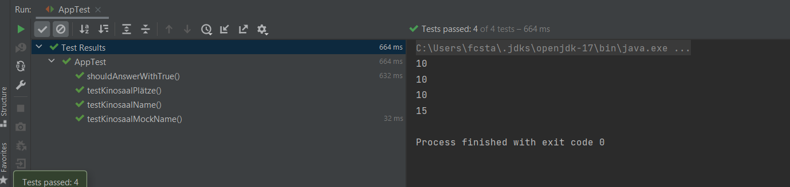

# Test-Driven-Development
## Theorie
Der Softwaretest ist der zentrale Bestandteil der Qualitätssicherung von Software. Je früher Fehler gefunden werden, desto geringer sind die Kosten die durch diese verursacht werden.

**Testpyramide**:
Tests sollen möglichst parallel zur entwickelten Funktionalität entstehen und nicht als Artefakt in einer Folgephase. Zusätzlich ist es sinnvoll die Testkonzeption nicht funktional von der Entwicklung zu trennen.

**Testablauf**:
Im Regelfall laufen Tests in verschiedenen Stufen ab. Dabei variieren die eingesetzten Teststufen und deren Ausprägung je nach Unternehmen und getestetem System.
Außerdem sind die letzten Teststufen tendenziell aufwändiger als die Vorangehenden.

**Testtools**:
Testtools ermöglichen dem Entwickler ein frühes Feedback über die Funktionsweise eines Systems. Gerade wenn über Refactoring weitreichende Änderungen durchgeführt werden ermöglichen Tests eine frühzeitige Fehlererkennung.
Ein einfaches und weit verbreitetes Testframework im JEE Umfeld ist **JUnit**. Mit dessen Hilfe lassen sich einfache Tests für Anwendungen programmieren.
Mit **Mockito** existiert ein weiteres Werkzeug das es dem Entwickler wesentlich vereinfacht gezielt Elemente der Geschäftslogik zu testen. Derartige Tests sind häufig aufwändig, da es oft nicht ohne weiteres möglich ist ein komplexes und in sich konsistentes Geschäftsobjekt zu erzeugen. Hier setzt Mockito an. Der Entwickler definiert nur die für ihn relevanten Objektteile oder Services.

## Aufgabe 2 

### Projektangabe und erste Tests
JUnit test und Mockito dependency


Domänen


Test ausführen:



## Aufgabe 3
Main-Class - Verschiedene Methoden testen.
``` java
public class App 
{
    public static void main( String[] args )
    {
        //Saal anlegen
        Map<Character,Integer> map = new HashMap<>();
        map.put('A',10);
        map.put('B',10);
        map.put('C',15);
        KinoSaal ks = new KinoSaal("LadyX",map);

        //Platz prüfen
        System.out.println(ks.pruefePlatz('A',11));
        System.out.println(ks.pruefePlatz('A',10));
        System.out.println(ks.pruefePlatz('B',10));
        System.out.println(ks.pruefePlatz('C',14));

        //Vorstellung anlegen
        Zeitfenster nachmittag = Zeitfenster.NACHMITTAG;
        Vorstellung vs1 = new Vorstellung(ks,nachmittag, LocalDate.of(2022,03,23),"Harry Potter",12.99f);

        //Vorstellung einplanen
        KinoVerwaltung kv = new KinoVerwaltung();
        kv.einplanenVorstellung(vs1);
        System.out.println(kv.getVorstellungen());

        kv.kaufeTicket(vs1,'A',5,13);

        //Debug
        System.out.println(kv.getVorstellungen());


    }
}
```

## AUFGABE 4: JUNIT-TESTS FÜR KINOSAAL
``` java
class KinoSaalTest {

    @Mock
    //Mocking Stub zum Testen

    private KinoSaal kinosaalOriginal;

    @BeforeEach
    void setUp() {
        //Saal anlegen
        Map<Character, Integer> map = new HashMap<>();
        map.put('A', 10);
        map.put('B', 10);
        map.put('C', 15);
        kinosaalOriginal = new KinoSaal("KS2", map);


    }

    @Test
    void getName() {

        assertEquals("KS2", kinosaalOriginal.getName());


    }

    @Test
    void pruefePlatz() {

        assertEquals(true,kinosaalOriginal.pruefePlatz('A',10));
        assertEquals(false,kinosaalOriginal.pruefePlatz('A',15));

    }

    @Test
    void testEquals() {
        assertEquals(true,kinosaalOriginal.equals(kinosaalOriginal)); //Ist das gegebene Objekt eine Instanz von Kinosaal?
        assertEquals(false,kinosaalOriginal.equals(15)); //

    }


    }
``` 
## AUFGABE 5: JUNIT-TESTS FÜR VORSTELLUNG
``` java
class VorstellungTest {


    private Vorstellung vorstellung;
    private KinoSaal ks;


    @BeforeEach
    void setUp() {
        //Saal anlegen
        Map<Character,Integer> map = new HashMap<>();
        map.put('A',10);
        map.put('B',10);
        map.put('C',15);
        ks = new KinoSaal("LadyX",map);


         vorstellung = new Vorstellung(ks,Zeitfenster.ABEND, LocalDate.of(2022,03,23),"Harry Potter",12.99f);
    }


    @Test
    void getFilm() {
        assertEquals("Harry Potter", vorstellung.getFilm(),"Der Name wird nicht richtig ausgelesen!");
    }

    @Test
    void getSaal() {
        assertEquals(ks, vorstellung.getSaal(),"Der Saal wird nicht richtig ausgelesen!");


    }

    @Test
    void getZeitfenster() {
        assertEquals(Zeitfenster.ABEND,vorstellung.getZeitfenster(),"Die Tageszeit wird nicht richtig ausgelesen!");
    }

    @Test
    void getDatum() {
        assertEquals(LocalDate.of(2022,03,23),vorstellung.getDatum(),"Das Datum wird nicht richtig ausgelesen!");

    }

    @Test
    void kaufeTicket() {

        assertTrue(vorstellung.kaufeTicket('A',10,13) instanceof Ticket,"Ticket-Kauf hat nicht funktioniert");

    }

    @Test
    void testEquals() {
        assertTrue(vorstellung.equals(vorstellung));
    }
}

```
## AUFGABE 6: JUNIT-TESTS FÜR KINOVERWALTUNG
siehe Aufgabe 7

## Aufgabe 7:
Ticket-Kauf-Test
``` java
@DisplayName("Ticket-Kauf-Test")
@ParameterizedTest(name = "Reihe: {0}, Platz: {1}, Geld: {2}")
@CsvSource({"A, 1, 13.0", "B, 2, 13.0", "C, 3, 13.0", "D, 4, 13.0"})
void kaufeTicket(char reihe, int platz, float geld) {


    assertTrue(vorstellung.kaufeTicket(reihe,platz,geld) instanceof Ticket);


    }
``` 

Vorgabe: Schreiben Sie einen Test, der validiert, dass das Anlegen einer Vorstellung korrekt funktioniert. Der
Test sollte eine fachliche Bezeichnung haben und die Assertions sollten bei Validierungsfehler eine
Hinweistext liefern.
und
Schreiben Sie einen Test, der validiert, dass das Einplanen mehrerer Vorstellungen korrekt
funktioniert. Stellen Sie zudem sicher, dass beim möglichen Auftreten eines Fehlers trotzdem alle
Validierungen ausgeführt werden.
->


